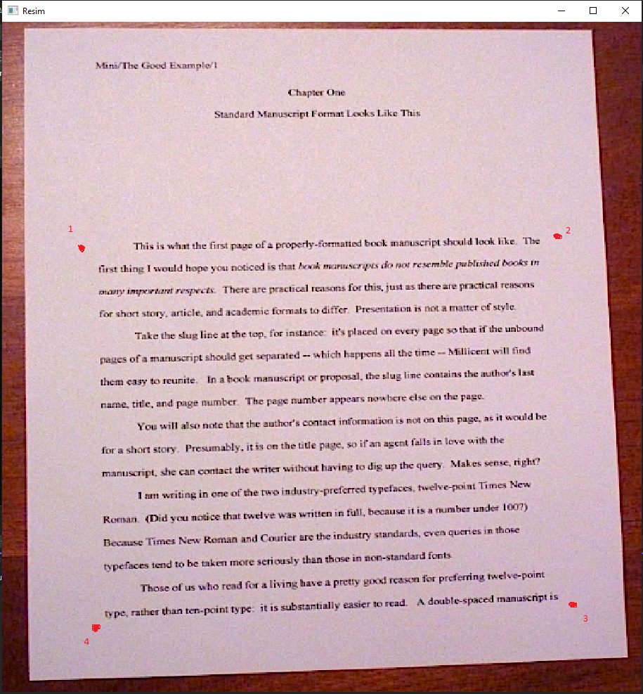
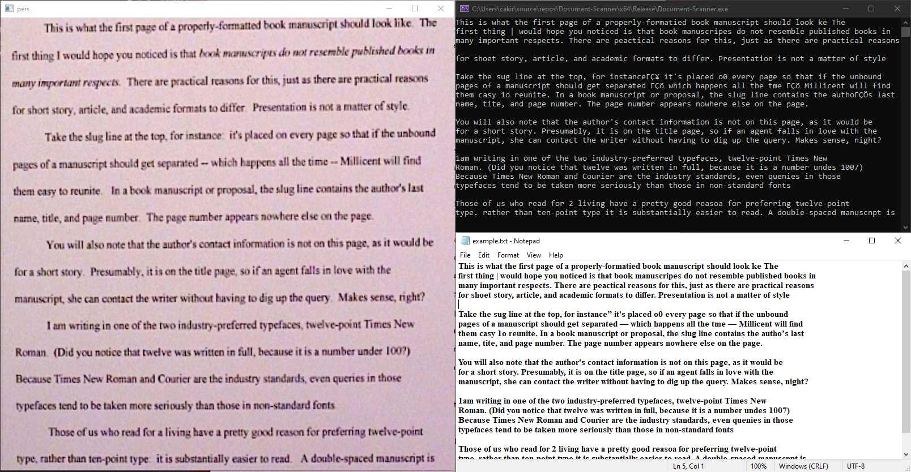

# Document-Scanner-with-Tesseract

First you need to determine Roi, you can do it with mouse right click. But you should do it like that.

Then you will get output and text file like that.

# Tesseract
I downloaded from [here](https://tesseract-ocr.github.io/tessdoc/Compiling.html) for visual studio
